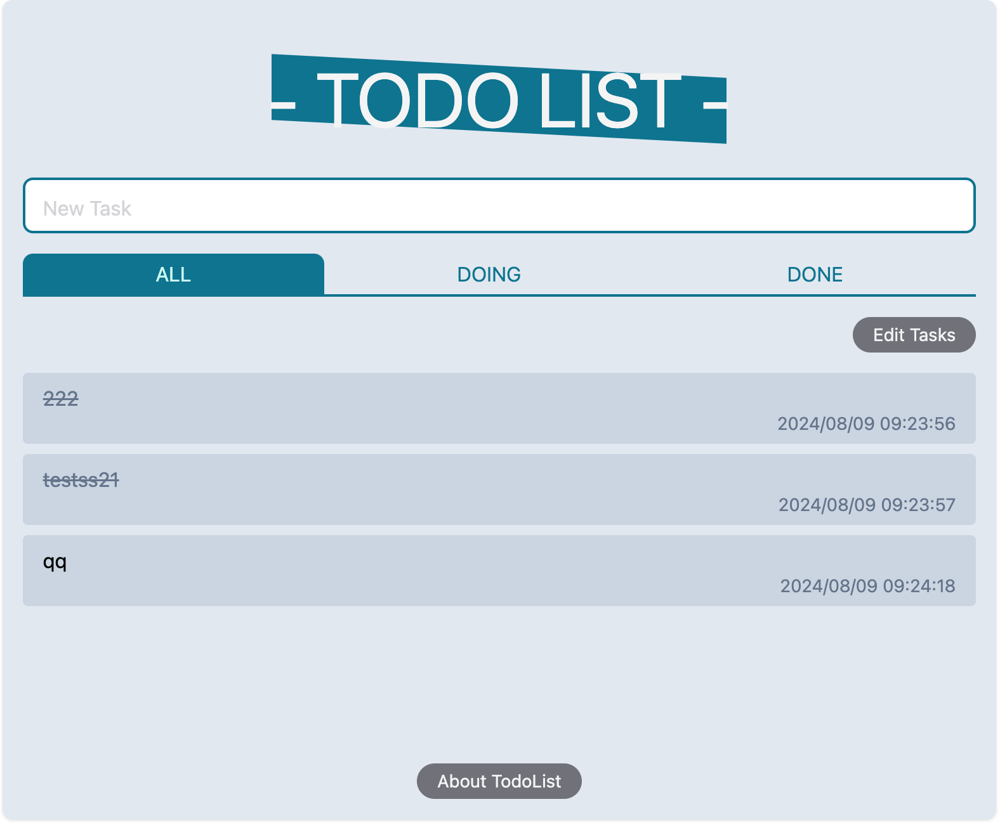
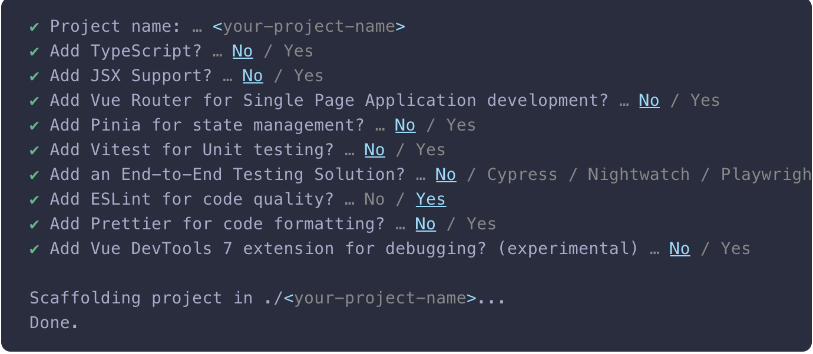

# Vue3 Todo List

This todo list is created with `Vue3`, `Vite`, `Pnpm`, `TypeScript`, and `Tailwind CSS`.



## 准备

- [node](http://nodejs.org/) >= 18.16, 项目开发环境使用 `pnpm`，请确保安装了 `pnpm`
- [git](https://git-scm.com/) - 版本管理工具
- [vscode](https://code.visualstudio.com/) - 代码编辑器
- [chrome](https://www.google.com/chrome/) - 浏览器

## 技术栈

- [Vite](https://vitejs.dev/) - 下一代的构建工具链
- [Vue3](https://v3.vuejs.org/) - 渐进式 JavaScript 框架
- [Tailwind CSS](https://tailwindcss.com/) - 基于实用工具的 CSS 原子类框架
- [Pinia](https://pinia.vuejs.org/zh/) - Vue3 的状态管理库
- [Ant-Design-Vue](https://antdv.com/docs/vue/introduce-cn/) - Vue3 的 UI 组件库
- [Vite](https://vitejs.dev/) - 下一代前端构建工具
- [TypeScript](https://www.typescriptlang.org/) - Familiar with the basic syntax of `TypeScript`
- [Es6+](http://es6.ruanyifeng.com/) - Familiar with es6 basic syntax

## 为什么选择这套技术栈？

### Vue 3

- **性能优越**：更快更节省内存。
- **灵活的API**：代码更容易维护。
- **优秀的类型支持**：与 TypeScript 配合更好。

### Vite

- **极速启动**：开发时即时热更新。
- **简单配置**：轻松支持各种前端框架。
- **高速打包**：生产环境构建更快。

### Pnpm

- **更高效的依赖管理**：节省磁盘空间，安装速度快。
- **一致的依赖版本**：减少版本冲突问题。

### TypeScript

- **类型检查**：减少错误。
- **更好维护性**：代码更易读、易维护。
- **强大的IDE支持**：更好的代码补全和导航。

### Tailwind CSS

- **快速样式开发**：更快实现设计。
- **易维护**：减少样式冲突。
- **高度可定制**：轻松调整设计系统。

### Pinia

- **简洁易用**：API设计简单直观。
- **与Vue 3深度集成**：完美支持组合式API。
- **优秀的类型支持**：与 TypeScript 搭配使用更强大。
- **开发工具支持**：易于调试和状态管理。

选择 Vue 3、Vite、Pnpm、TypeScript、Tailwind CSS 和 Pinia 这一组合，可以大幅提升开发效率、性能与代码质量，适合各种规模和复杂度的前端项目。

## TodoList 功能

- [x] 添加任务
- [x] 删除任务
- [x] 编辑任务
- [x] 完成任务
- [x] 任务列表

## 如何快速创建一个 Vue 项目

- [参考 Vue 官方文档](https://cn.vuejs.org/guide/quick-start.html)

确保你安装了最新版本的 Node.js并安装 pnpm，并且你的当前工作目录正是打算创建项目的目录。在命令行中运行以下命令

```bash
npm install pnpm@latest -g
pnpm create vue@latest
```

按照如下提示选择配置及输入项目名称：



在项目被创建后，通过以下步骤安装依赖并启动开发服务器：

```bash
cd <your-project-name>
pnpm install
pnpm run dev
```

- 现在应该已经运行起来了你的第一个 Vue 项目. 推荐使用组合式 API 和 `<script setup>` 来编写组件。
- 推荐的 IDE 配置是 Visual Studio Code + Vue - Official 扩展。
- 若项目中需要安装其他依赖，请使用 `pnpm install <package-name>` 命令。如：安装 lodash 工具, 命令行执行 `pnpm install lodash-es`.

当你准备将应用发布到生产环境时，请运行：

```bash
pnpm run build
```

如何配置后端 server? 在 `vite.config.ts` 中配置 `server.proxy`，将请求代理到后端服务器。

```bash
// vite.config.ts
 server: {
    proxy: {
      '/api/v1': {
        target: 'http://47.100.36.186:8000',
        changeOrigin: true,
        ws: true,
        // rewrite: (path) => path.replace(new RegExp(`^/api`), ''),
        // only https
        // secure: false
      },
    },
    open: true, // 项目启动后，自动打开
  },
```

## 部署

将应用部署到生产环境时，请运行：

此命令会在 ./dist 文件夹中为你的应用创建一个生产环境的构建版本。关于将应用上线生产环境的更多内容
，请参考 [部署](https://cn.vuejs.org/guide/deployment.html)。

## 准备开发

- Get the project code

```bash
git clone xxx
```

- Install dependencies

```bash
cd vue3-todolist
pnpm install
```

- run

```bash
pnpm run dev
```

访问地址：http://localhost:5173

- build

```bash
pnpm run build
```

## 容器部署

- Dockerfile 文件在项目根目录下，可以根据项目需要修改。
- 容器会使用根目录下的 `nginx.conf` 配置来启动 nginx，转发静态文件和代理请求。可以根据需要修改 `nginx.conf` 文件。

#### 构建镜像

```bash
docker build -t vue3-todolist .
```

#### 运行镜像

```bash
docker run --name vue3-todolist -d -p 6666:80  vue3-todolist
```

Then you can navigate to `http://localhost:6666`


## 项目结构

```
├── public
│   └── index.html
├── src
│   ├── assets
│   ├── components
│   ├── layouts
│   ├── pages
│   ├── router
│   ├── store
│   ├── styles
│   ├── utils
│   ├── App.vue
│   ├── main.ts
│   └── shims-vue.d.ts
├── .gitignore
├── .prettierrc
.js
├── index.html
├── package.json
├── pnpm-lock.yaml
├── tsconfig.json
└── vite.config.ts
```

## 如何开发一个业务页面？

1. `src/views` 下添加一个页面组件，新建 `src/views/.vue` 文件，并编写页面代码。输入 `vue3` 快速生成一个 vue3 组件的模板代码。[如何配置 vscode 快速生成 vue3 模板代码](https://www.cnblogs.com/cn-oldboy/p/18000841)。
2. 再`src/router/index.ts` 中添加路由, 并配置路由 `import` 该组件，访问该路由即可。

### 其他

- 在 `src/router` 中创建一个文件，用于存放该页面的路由。
- 在 `src/api` 中创建一个文件，用于存放该页面的 API 请求。
- 在 `src/store` 中创建一个模块，用于管理该页面的状态。
- 在 `src/utils` 中创建一个文件，用于存放该页面的工具函数。
- 在 `.env` 文件中创建一个变量，用于存放该页面的环境变量。

## Browser support

The `Chrome 80+` browser is recommended for local development